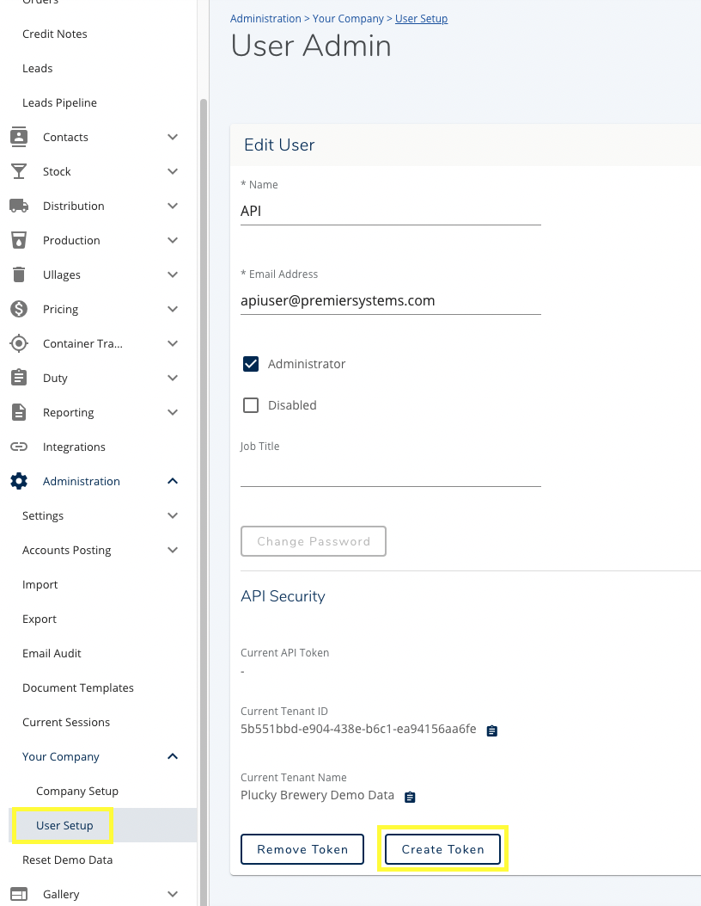
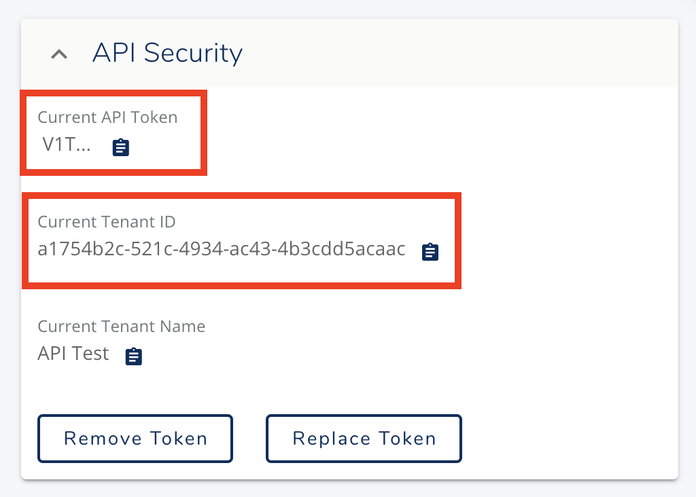

## Brewman Web - Web API - BETA

** The API schema and documentation is in beta and subject to change until final release. We may make changes to API 
definitions that could cause client code to break. We will inform all customers via our ApiUsers chat room if this is 
likely.**

This repository contains the necessary resources and information to make API requests to the Brewman brewery and 
distillery management web product.

*Note. This API is not for the Brewman 6 desktop application.*

### Overview
We publish a web api for our customers to use with supporting OpenApi documentation.

- [Complete Reference Documentation](https://brewman.premiersystems.com/swagger/index.html)

You are free to make calls to our api endpoints using the json as described in the documentation. You may find it useful to utilise the many tools that create client libraries from our [open api json spec](https://brewman.premiersystems.com/swagger/v1/swagger.json).

### Authentication
The API is designed to make requests as a Brewman user. We recommend creating a new user in Brewman specifically for your 
API so you will be able to see in the web application what entities are created/updated by your program.

Once you have created the user you will be able to generate an API token from the following screen:

Then you can capture the token and tenant identifier for use in API calls.

The API Token needs be sent on every request to our API in an HTTP header called `Api-Token`.

Our service is multi-tenanted, which allows a single user to interact with multiple breweries, businesses, or departments.
The current tenants id is included on this screen and will need to be supplied to nearly all our API methods in the request
payload. This is documented in each method.

### Getting Started

We recommend looking at our included test case for creating an order to get started with our API.

[Create Order Example Code](./src/tests/orders.test.ts)

To run this test yourself you would need to update `./src/auth.ts` to include the values appropriate to your tenant. 

### Rate Limiting / Pricing
This API has been requested by our customers to help with some back office tasks and performing ecommerce integrations. 
We do not expect a heavy load from API requests, as such we do not currently anticipate the requirement for any rate 
limiting or passing any increased hosting costs to our customers.

API requests also do not currently occupy a concurrent license and will not prevent real users logging in.

### Support
While in BETA, support is limited to best-effort. Please contact support for details on joining our BETA testing program.
